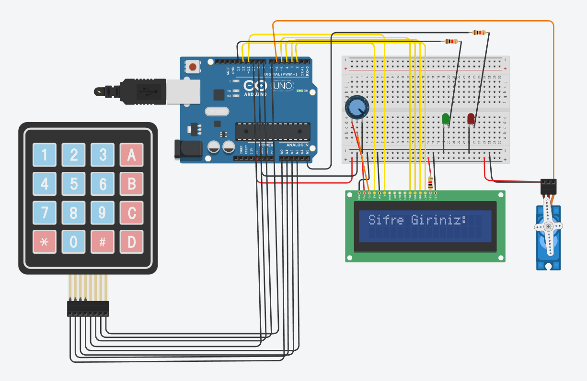

# 🔒 Arduino Based Secure Vault System (EEPROM & Panic Mode)

## 📌 Proje Özeti
Bu proje, **Arduino Uno** mikrodenetleyicisi kullanılarak geliştirilmiş; kalıcı hafıza (EEPROM) yönetimi, brute-force saldırı koruması ve panik modu özelliklerine sahip gelişmiş bir elektronik kasa sistemidir.

Tinkercad üzerinde simüle edilmiş ve C++ ile kodlanmıştır.

## 🚀 Özellikler
* **💾 Non-Volatile Memory (EEPROM):** Enerji kesintilerinde bile şifre korunur.
* **🚨 Panik Modu:** Tehdit altındayken `9999` girildiğinde kapı açılır ancak sessiz alarm tetiklenir.
* **🛡️ Brute-Force Koruması:** 3 hatalı girişten sonra sistem kendini 10 saniye kilitler (Freeze).
* **🔑 Yönetici Paneli:** Master kod (`0000`) ile şifre değiştirme imkanı.
* **📟 Kullanıcı Dostu Arayüz:** LCD ekran ve Keypad ile interaktif kullanım.

## 🛠️ Donanım Gereksinimleri
| Bileşen | Adet | Açıklama |
|---|---|---|
| Arduino Uno R3 | 1 | Mikrodenetleyici |
| 16x2 LCD Ekran | 1 | Bilgi Ekranı |
| 4x4 Keypad | 1 | Tuş Takımı |
| Mikro Servo Motor | 1 | Kilit Mekanizması |
| LED (Kırmızı/Yeşil) | 2 | Durum Göstergeleri |
| Direnç (220Ω) | 3 | Akım Sınırlayıcı |

## 🔌 Pin Konfigürasyonu
| Modül | Pin | Arduino Pin |
|---|---|---|
| **Servo** | Sinyal | D6 |
| **LCD** | RS, E, D4-D7 | 12, 11, 5, 4, 3, 2 |
| **Keypad** | Satırlar | A0, A1, A2, A3 |
| **Keypad** | Sütunlar | 10, 9, 8, 7 |
| **LED** | Yeşil / Kırmızı | 13 / A5 |

## 👨‍💻 Geliştirici
**Göktan Arda Kınacı** 

---
*Bu proje Yazılım Mühendisliği lisans dersi kapsamında geliştirilmiştir.*
